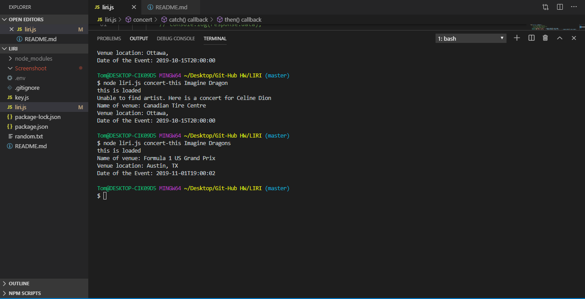
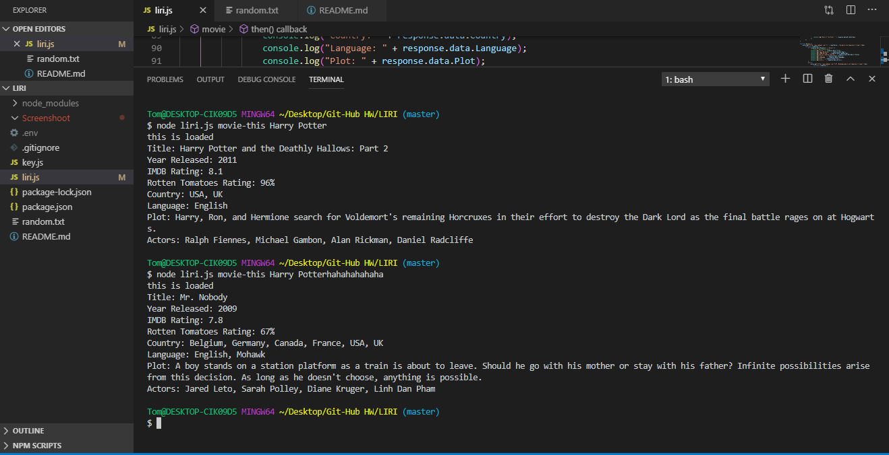
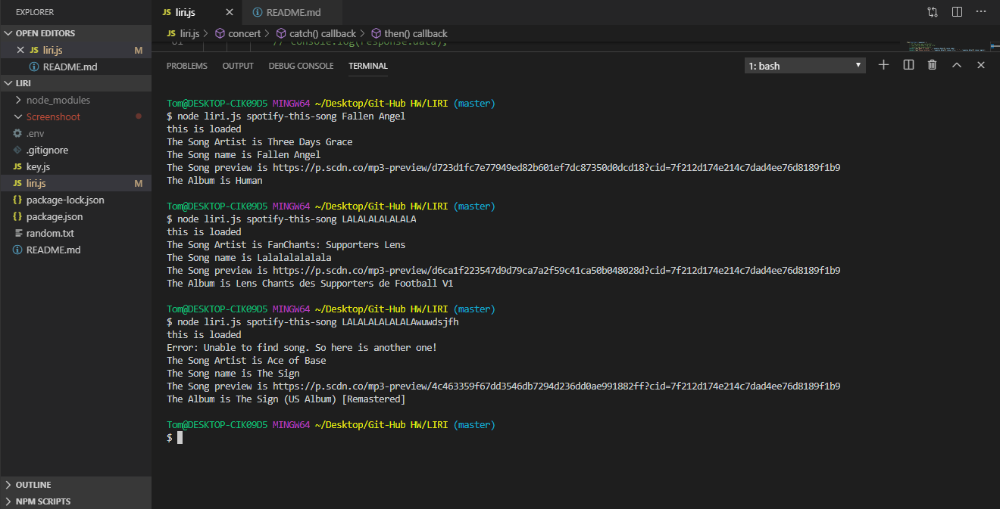
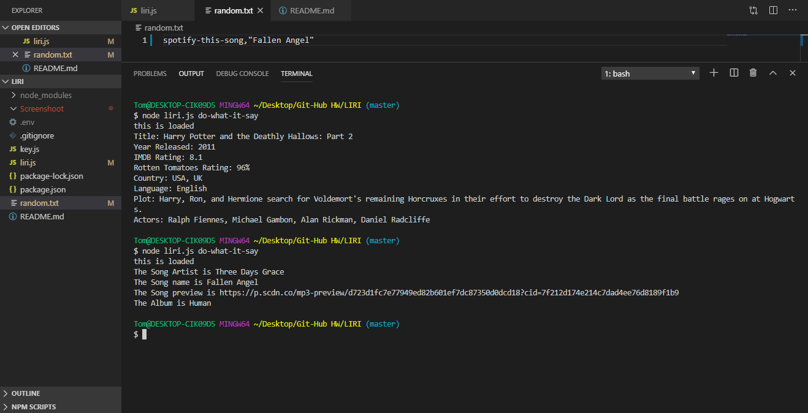

# LIRI

1. LIRI will search Spotify for songs, Bands in Town for concerts, and OMDB for movies.

2. The app contain a switch function that contain 4 different cases. In each case will be a function that run it.

3. To run the app, go to your terminal and type `node liri.js (Your command) (what you search for)`

4. ScreenShots:
   
   
   
   

5. Technology and Packages usage in the app.

   * [Node-Spotify-API](https://www.npmjs.com/package/node-spotify-api)

   * [Axios](https://www.npmjs.com/package/axios)

     * You'll use Axios to grab data from the [OMDB API](http://www.omdbapi.com) and the [Bands In Town API](http://www.artists.bandsintown.com/bandsintown-api)

   * [DotEnv](https://www.npmjs.com/package/dotenv)

